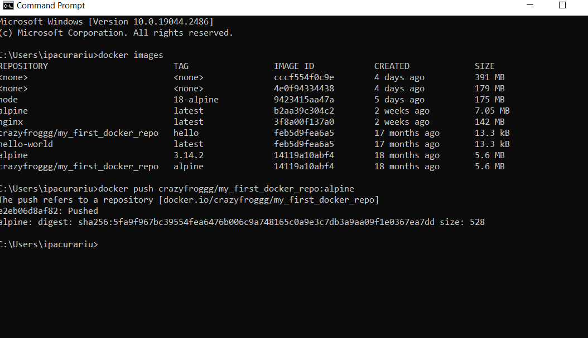
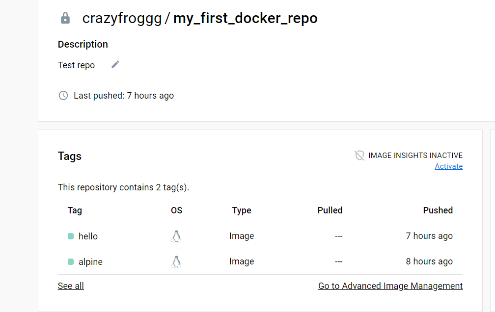

# Week 1 — App Containerization

- Installed Docker extension in VSCode (Gitpod);
- We need to create two containers, for backend and frontend and run the application using `docker-compose`.

## Containerize backend
### Add Dockerfile
- inside `backend-flask/` created a file named `Dockerfile`
- we put the following sequence here:
```bash
FROM python:3.10-slim-buster

# Inside Container
# make a new folder inside container
WORKDIR /backend-flask

# Outside Container -> Inside Container
# this contains the libraries we want to install to run the app
COPY requirements.txt requirements.txt

# Inside Container
# install the python libraries used for the app
RUN pip3 install -r requirements.txt

# Outside Container -> Inside Container
# . means everything in the current dir
# first . - /backend-flask (outside container)
# second . -/backend-flask (inside container)
COPY . .

# Set environment variables (Env Vars)
# Inside Container and will remain set when the container is running
ENV FLASK_ENV=development

EXPOSE ${PORT}

# CMD(Command)
# python3 -m flask run --host=0.0.0.0 --port=4567
CMD [ "python3", "-m" , "flask", "run", "--host=0.0.0.0", "--port=4567"]
```

### Build the container
```
docker build -t  backend-flask ./backend-flask
```
### Run the container
- We can test if the container is running using the following commands:
```bash
docker run --rm -p 4567:4567 -it backend-flask
FRONTEND_URL="*" BACKEND_URL="*" docker run --rm -p 4567:4567 -it backend-flask
export FRONTEND_URL="*"
export BACKEND_URL="*"
docker run --rm -p 4567:4567 -it -e FRONTEND_URL='*' -e BACKEND_URL='*' backend-flask
docker run --rm -p 4567:4567 -it  -e FRONTEND_URL -e BACKEND_URL backend-flask
unset FRONTEND_URL="*"
unset BACKEND_URL="*"
```
- If we want the container to run in the background, we can use the following command line:
```bash
docker run --rm -p 4567:4567 -d backend-flask
```
## Containerize frontend
### Run NPM install 
- we have to run `npm install` before building a container, since it needs to copy the contents of `node_module`
```bash
cd frontend-react-js
npm i
```
***
Pro tip: After creating the `docker-compose.yml` file (a few steps later) , we can add for the backend-flask the following volume:
```bash
- /frontend-react-js/node_modules
```
This will bring the contents of the `node_module` automatically when initializing the containers, removing the necesity to manually install NMP.
***

### Add Dockerfile
- inside `frontend-react-js/` we create a file named `Dockerfile`, and we copy the following code there:
```bash
FROM node:16.18

ENV PORT=3000

COPY . /frontend-react-js
WORKDIR /frontend-react-js
RUN npm install
EXPOSE ${PORT}
CMD ["npm", "start"]
```
### Build the container
- we do this running the following comand, in the terminal:
```bash
docker build -t frontend-react-js ./frontend-react-js
```
### Run the container
```bash
docker run -p 3000:3000 -d frontend-react-js
```

## Multiple containers

To run multiple containers we need to create a `docker-compose.yml` file, in the root directory, with the following code in it:
```bash
version: "3.8"
services:
  backend-flask:
    environment:
      FRONTEND_URL: "https://3000-${GITPOD_WORKSPACE_ID}.${GITPOD_WORKSPACE_CLUSTER_HOST}"
      BACKEND_URL: "https://4567-${GITPOD_WORKSPACE_ID}.${GITPOD_WORKSPACE_CLUSTER_HOST}"
    build: ./backend-flask
    ports:
      - "4567:4567"
    volumes:
      - ./backend-flask:/backend-flask
  frontend-react-js:
    environment:
      REACT_APP_BACKEND_URL: "https://4567-${GITPOD_WORKSPACE_ID}.${GITPOD_WORKSPACE_CLUSTER_HOST}"
    build: ./frontend-react-js
    ports:
      - "3000:3000"
    volumes:
      - ./frontend-react-js:/frontend-react-js

# the name flag is a hack to change the default prepend folder
# name when outputting the image names
networks: 
  internal-network:
    driver: bridge
    name: cruddur
```

## DynamoDB local & Postgres
I've succesfuly managed to bring DynamoDB local and Postgres as containers, for future uses, by making the following additions to the `docker-compose.yml` file:
### Postgres:
```bash
services:
  db:
    image: postgres:13-alpine
    restart: always
    environment:
      - POSTGRES_USER=postgres
      - POSTGRES_PASSWORD=password
    ports:
      - '5432:5432'
    volumes: 
      - db:/var/lib/postgresql/data
volumes:
  db:
    driver: local
```
- installed Postgres into Gitpod using the following command:
```bash
  - name: postgres
    init: |
      curl -fsSL https://www.postgresql.org/media/keys/ACCC4CF8.asc|sudo gpg --dearmor -o /etc/apt/trusted.gpg.d/postgresql.gpg
      echo "deb http://apt.postgresql.org/pub/repos/apt/ `lsb_release -cs`-pgdg main" |sudo tee  /etc/apt/sources.list.d/pgdg.list
      sudo apt update
      sudo apt install -y postgresql-client-13 libpq-dev
```

### DynamoDB
```bash
services:
  dynamodb-local:
    # https://stackoverflow.com/questions/67533058/persist-local-dynamodb-data-in-volumes-lack-permission-unable-to-open-databa
    # We needed to add user:root to get this working.
    user: root
    command: "-jar DynamoDBLocal.jar -sharedDb -dbPath ./data"
    image: "amazon/dynamodb-local:latest"
    container_name: dynamodb-local
    ports:
      - "8000:8000"
    volumes:
      - "./docker/dynamodb:/home/dynamodblocal/data"
    working_dir: /home/dynamodblocal
```
- directory volume mapping:
```bash
volumes: 
- "./docker/dynamodb:/home/dynamodblocal/data"
```
- named volume mapping:
```bash
volumes: 
  - db:/var/lib/postgresql/data

volumes:
  db:
    driver: local
```

## Extra stuff
- After doing the mandatory work, I've played a bit with Docker, watched some more tutorials and tried to create some simple usecases, to prove myself I understood it;
- Due to lack of time, I've only managed to push and tag some simple images into my Dockerhub account, but planning to do more.

